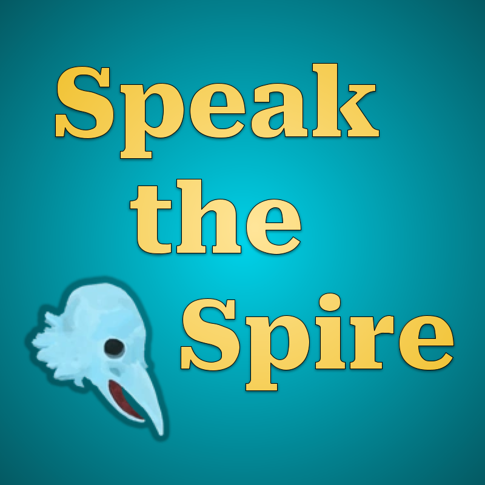

  

So you've walked your way to the top, but have you talked your way to the top?

This mod lets you do just that: play the game Slay the Spire with only voice commands.

## Installation

> Note: if you are having any issues, make sure that your speak-the-spire-talon
> Talon files are up to date! They will not auto update, so periodically you
> will have to update them manually to get the latest functionality.

There are five different elements that you will need to install to get Speak the
Spire up and running. What could go wrong?

1. Talon Voice software: free, amazing speech engine and Python-based framework
1. talonhub/community: set of voice command scripts written by the community
1. brollin/speak-the-spire-talon: (this repo) Speak the Spire Talon voice
   commands
1. Slay the Spire, installed via Steam
1. Speak the Spire Mod, and the mods it depends on

The first two will be familiar to prior Talon users. There isn't anything
special about step (3) besides putting this repository inside your Talon user
directory, so feel free to skip the next section if doing that is familiar to
you.

### Installing the Talon side

We will be installing Talon Voice, which is a very powerful voice command
framework. If you would like more information about Talon, its installation, and
basic usage, refer to the [Talon wiki](https://talon.wiki/getting_started/).

1. Install [Talon Voice](https://talonvoice.com/).
2. Install [talonhub/community](https://github.com/talonhub/community) one of
   two ways:

- [with git](https://github.com/talonhub/community?tab=readme-ov-file#installation)
  if you are comfortable with the command line and git, or
- [via zip file](https://github.com/talonhub/community?tab=readme-ov-file#alternate-installation-method-zip-file)
  if not

3. Install
   [speak-the-spire-talon](https://github.com/brollin/speak-the-spire-talon),
   this repository, the same way that you installed talonhub/community above.

- with git, inside your Talon user directory:
  `git clone https://github.com/brollin/speak-the-spire-talon speak-the-spire-talon`
- via zip file, by extracting the contents of
  [this zip file](https://github.com/brollin/speak-the-spire-talon/archive/refs/heads/main.zip)
  into your Talon user directory

You should now have a very powerful set of voice commands available to you to
control your computer. You can learn some
[basic commands](https://talon.wiki/basic_usage/) on the wiki.

### Installing Slay the Spire + mods

1. Install Slay the Spire with Steam.
1. Install
   [Speak the Spire](https://steamcommunity.com/sharedfiles/filedetails/?id=3159200524)
   and its required mods in the Steam workshop.

Note: You install mods by "subscribing" to them. The required mods are listed on
the Speak the Spire mod page, and they are:
[ModTheSpire](https://steamcommunity.com/workshop/filedetails/?id=1605060445),
[BaseMod](https://steamcommunity.com/workshop/filedetails/?id=1605833019), and
[Keyboard Shortcuts](https://steamcommunity.com/workshop/filedetails/?id=2173245479).

## How to use

> TODO: I will expand this section in the future, so for now when in doubt take
> a look at all of the voice commands in
> [speak_the_spire.talon](./speak_the_spire.talon).

### General menu navigation

Generally, whenever you see a menu item or button in the game, you should be
able to just speak what you see. For example:

- On the main menu screen, "play" to begin a game
- On the main menu screen, "continue" to continue a game
- On the character select screen, "ironclad", "silent", "defect", "watcher" to
  select that character
- On the character select screen, "embark" to begin the run
- And more, but note that all menu navigation is implemented quite yet!

### Event navigation

At the moment, this mod relies heavily on the excellent
[Keyboard Shortcuts](https://steamcommunity.com/workshop/filedetails/?id=2173245479)
mod. This mod adds numbers for different options, and allows you to press a
number to choose that option. So to make choices during Neow's Gift (how every
run starts), events, campfires, and more, you can simply say the number of the
choice.

If you see a button like "return", "cancel", "confirm", or "proceed", remember
that you can just say that word to click that button.

### General gameplay commands

- "map" to toggle the map
- "deck" to toggle viewing your deck
- "draw"/"draw pile" to toggle viewing your draw pile
- "disc"/"discard"/"discard pile" to toggle viewing your discard pile
- "exhaust"/"exhaust pile" to toggle viewing your exhaust pile
- "end turn" to end your turn
- "menu" to toggle the in-game menu

### Potions

- "potion" clicks your first potion
- "potion 1"/"potion 2"/etc clicks that potion
- "drink"/"throw"/"discard" to use the potion in that way

Note that you first must essentially select a potion by saying one of the first
two commands, like "potion". When you do, a potion UI will pop up with different
options which you can just say.

Want to close the popup? Just move your mouse somewhere else and click, such as
with the "center" command.

### Relics

- "relic" mouses over your first relic
- "relic 1"/"relic 2"/etc mouses over that relic

### Combat commands

- "player" mouses over your character
- "enemy" mouses over the first enemy
- "enemy 1"/"enemy 2"/etc mouses over that enemy
- "orb"/"orb 1"/etc masses over that orb
- "one"/"two"/etc selects that card from your hand
- "use 1"/"use 2"/etc uses that card from your hand on the currently hovered
  enemy

### Combat rewards / boss relic rewards

- "reward 1"/"reward 2"/etc mouses over that reward

The above command works for combat rewards (gold, potion, card reward) as well
as boss relic rewards (the three boss relic options after a boss fight). To
actually make the selection, you can click or say the number.

### Merchant / shop

- "shop relic 1"/etc mouses over that shop relic option
- "shop potion 1"/etc mouses over that shop potion option
- "remove card"/(and lots of variations) mouses over the "Card Removal Service"

To purchase a relic or potion, use a command from above and then click.

To purchase a card, simply say its number.

### Known limitations

Some actions don't have voice commands yet, so you will need to use a mouse or
the talonhub/community voice commands. Here are the list of things that aren't
supported quite yet:

- The main game menus have decent coverage, but not yet complete coverage.
- No built-in way to scroll up and down.
- No way to deselect cards in a multicard selection situation, such as when you
  use the gambler's brew potion.
- The shop has some card numbering bugs sometimes, in particular when the
  Courier relic is in play.
- In some fights with respawning enemies (slimes, Collector, Reptomancer, etc),
  the enemy numbering is tricky, so it behaves a little differently.

See something else? It would be great if you could file an issue here on GitHub.

## Contributing

> This is the Talon portion of the Slay the Spire voice command mod "Speak the
> Spire". See [SpeakTheSpireMod](https://github.com/brollin/SpeakTheSpireMod)
> for the mod portion, but note that the majority of the documentation is in
> this repo.

Please help me make this better by filing issues or submitting pull requests!

## Thanks

Special thanks to Mjonkey for the help working out some early issues on Windows!
